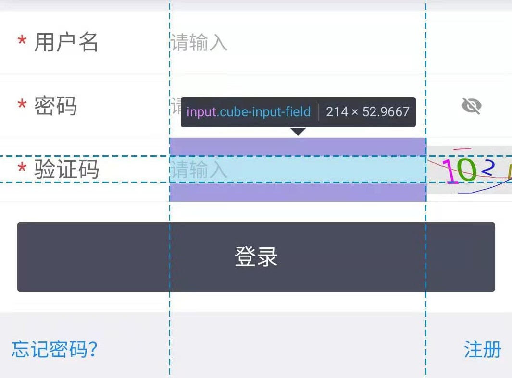
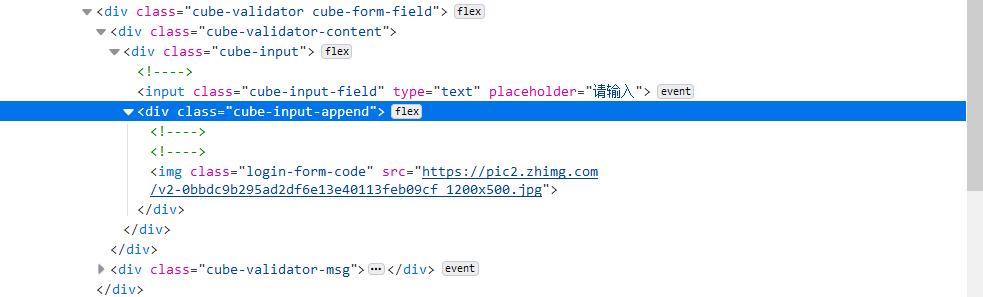
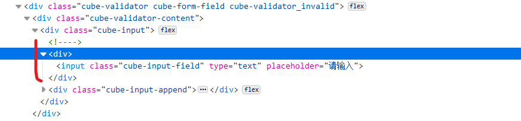
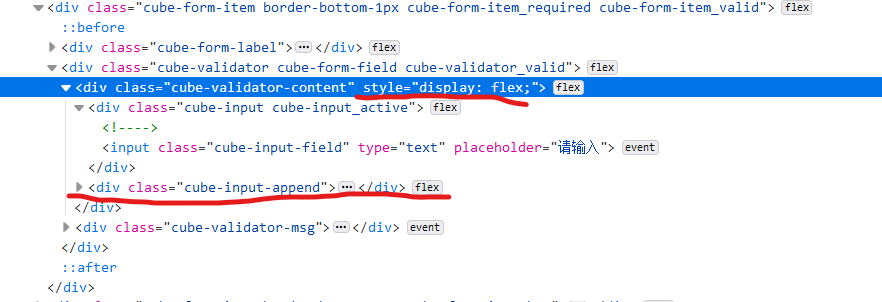
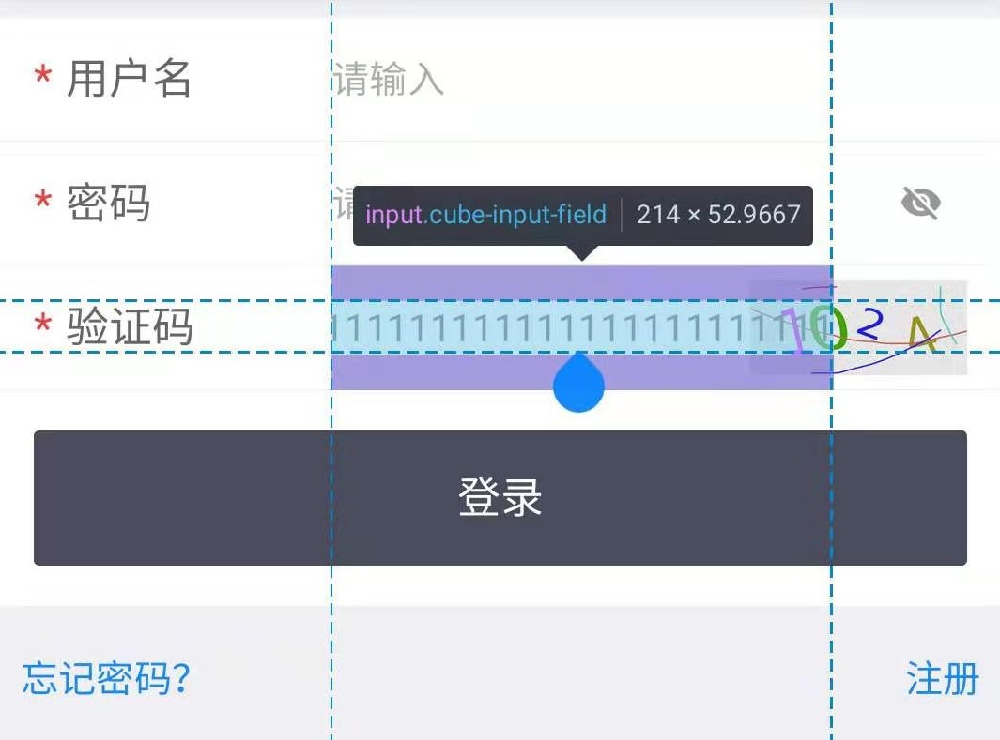
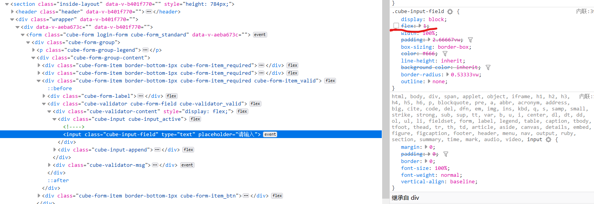
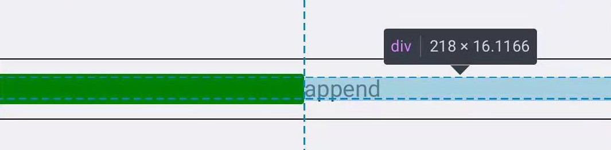
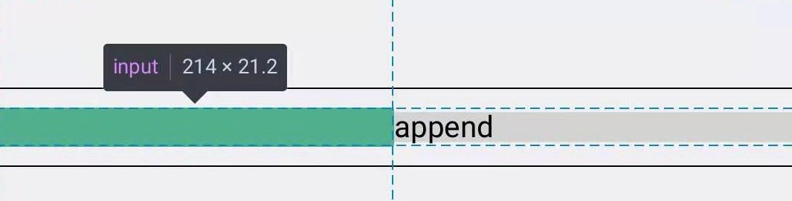
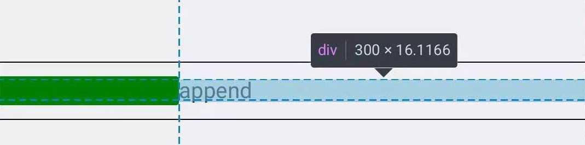

# 表单input样式bug

如下图所示




### 在安卓端（ios没测试）firefox下无法正常显示，其他常见浏览器均正常

## 1，解决方案一

伪代码如下
```html
<cube-input>
    <div><input></div>
    <append>...</append>
</cube-input>
```


用一个```<div>```包裹```<input>```，最终显示正常

## 2，方案二

伪代码如下
```html
<form-item style="display:flex;align-item:center;">
    <cube-input />
    <append>...</append>
</form-item>
```



但却引发新的bug，没错这个bug也只有安卓火狐出现



解决方式也很简单，去掉```flex:1```属性




## 3，原因

如下，自行体会，具体我也不清楚 : )

实验0：
```html
<input style="background-color:green;">
```


实验1：

```html
<div style="width:100%;padding:10px 0;border:1px solid black;display:flex;align-items:center;">
    <input style="width:100%;background-color:green;flex:1;">
</div>
```


实验2：

```html
<div style="width:100%;padding:10px 0;border:1px solid black;display:flex;align-items:center;">
    <input style="width:100%;background-color:green;flex:1;">
    <div style="width:300px;background-color:#d3d3d3;">append</div>
</div>
```



实验3：

```html
<div style="width:100%;padding:10px 0;border:1px solid black;display:flex;align-items:center;">
    <div style="flex:1;">
        <input style="width:100%;background-color:green;">
    </div>
    <div style="width:300px;background-color:#d3d3d3;">append</div>
</div>
```


实验0，```input```有一个默认大小的```width```（）

实验2，```append```元素本应占```300px```，而实际只占```218px```

实验3，给```input```包裹一层```div```，```append```元素显示正常